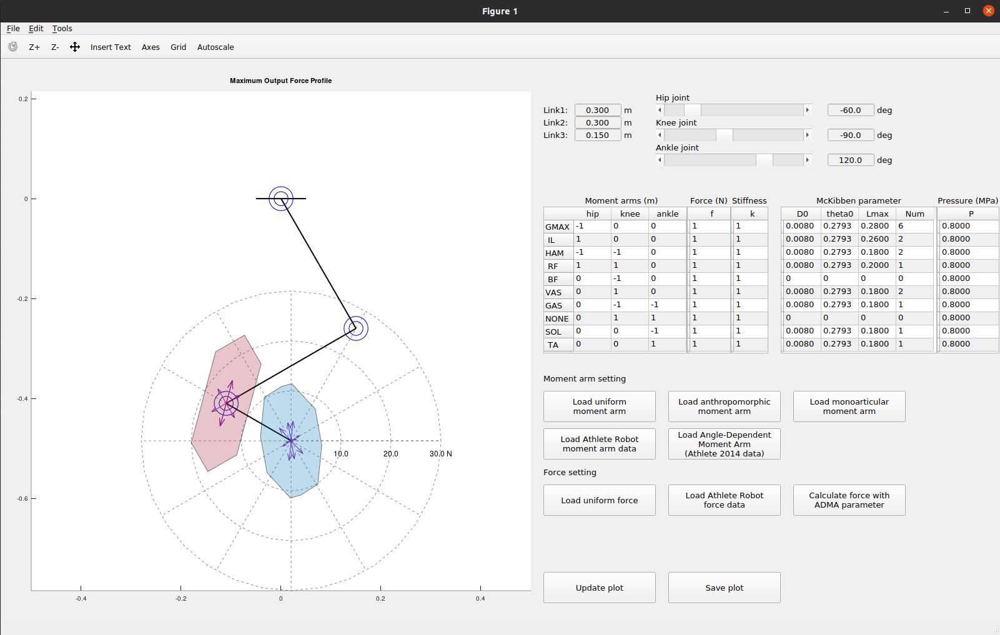

# musculoskeletal-MOFP

Scripts to run Maximum Output Force Profile (MOFP) on a musculoskeletal leg.

Originally, the scripts ran on MATLAB, then the updated version is now running on Octave.

For the details about how MOFP analysis run, please check the notes on:
[blog link](https://tandukion.github.io/blog/2017/11/30/musculoskeletal-force-profile.html).

The analysis is based on the paper listed on the References section

## Running the script
There are two ways to run the script:
- Command window
  
  Run the command 
  ```
  mainMOFP
  ```
  on Octave command window to run without GUI.
  If you need to modify some data, edit directly on the scripts.

- GUI

  The scripts provide a GUI to run the MOFP analysis. Run command
  ```
  mainMOFPGUI
  ```
  on Octave window. Then, edit the desired data on the GUI.
  The analysis will be updated on GUI

  

## References:
[1] R. Niiyama and Y. Kuniyoshi,
“Design principle based on maximum output force profile for a musculoskeletal robot”.
Industrial Robot: An International Journal, 2010.

[4] K. Ito, T. Tsuji, and M. Nagamachi.
"Motor impedance and inverse kinematics in musculoskeletal systems"
Proceedings of the Annual International Conference of the IEEE Engineering in Medicine and Biology Society, pp. 635-636, 1988.